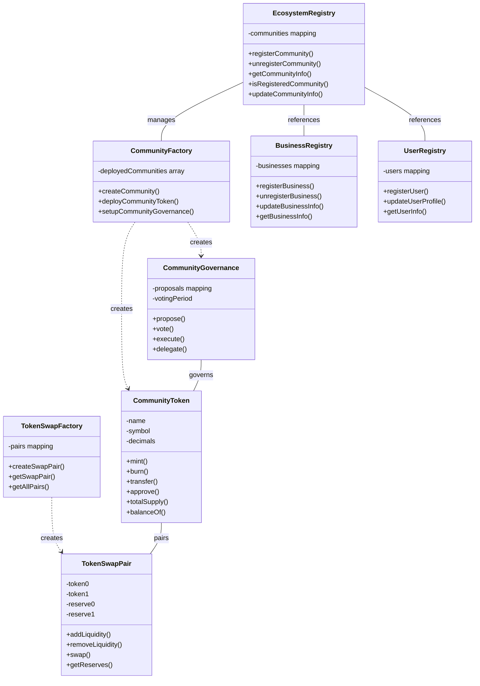

```mermaid
classDiagram
    class EcosystemRegistry {
        +registerCommunity()
        +unregisterCommunity()
        +getCommunityInfo()
        +isRegisteredCommunity()
        +updateCommunityInfo()
        -communities mapping
    }

    class CommunityFactory {
        +createCommunity()
        +deployCommunityToken()
        +setupCommunityGovernance()
        -deployedCommunities array
    }

    class CommunityToken {
        +mint()
        +burn()
        +transfer()
        +approve()
        +totalSupply()
        +balanceOf()
        -name
        -symbol
        -decimals
    }

    class CommunityGovernance {
        +propose()
        +vote()
        +execute()
        +delegate()
        -proposals mapping
        -votingPeriod
    }

    class TokenSwapFactory {
        +createSwapPair()
        +getSwapPair()
        +getAllPairs()
        -pairs mapping
    }

    class TokenSwapPair {
        +addLiquidity()
        +removeLiquidity()
        +swap()
        +getReserves()
        -token0
        -token1
        -reserve0
        -reserve1
    }

    class BusinessRegistry {
        +registerBusiness()
        +unregisterBusiness()
        +updateBusinessInfo()
        +getBusinessInfo()
        -businesses mapping
    }

    class UserRegistry {
        +registerUser()
        +updateUserProfile()
        +getUserInfo()
        -users mapping
    }

    EcosystemRegistry -- CommunityFactory : manages
    CommunityFactory ..> CommunityToken : creates
    CommunityFactory ..> CommunityGovernance : creates
    TokenSwapFactory ..> TokenSwapPair : creates
    EcosystemRegistry -- BusinessRegistry : references
    EcosystemRegistry -- UserRegistry : references
    CommunityToken -- TokenSwapPair : pairs
    CommunityGovernance -- CommunityToken : governs
```
