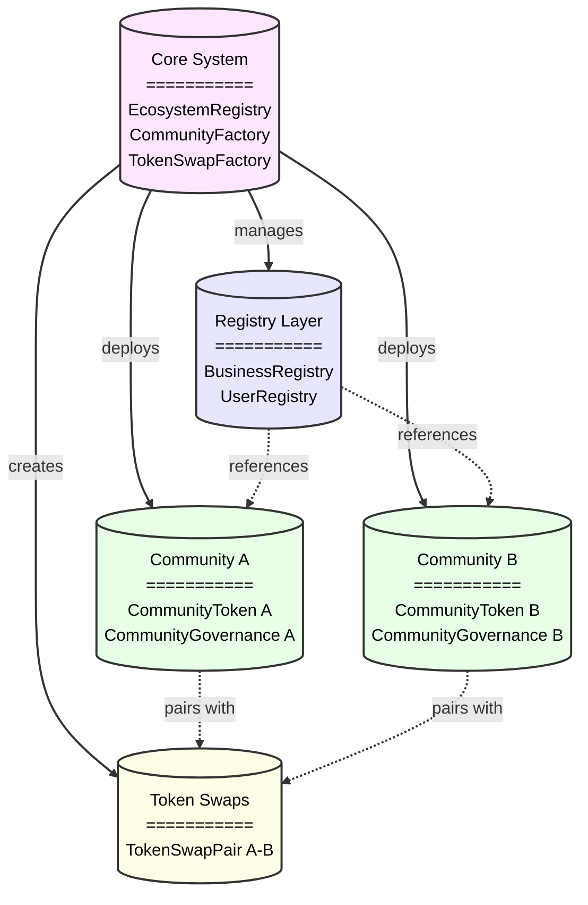

```mermaid
flowchart TD
    %% Define styles with better contrast
    linkStyle default stroke-width:2px,color:#333
    style Core fill:#ffe6ff,stroke:#333,stroke-width:2px,color:#000
    style Registries fill:#e6e6ff,stroke:#333,stroke-width:2px,color:#000
    style CommunityA fill:#e6ffe6,stroke:#333,stroke-width:2px,color:#000
    style CommunityB fill:#e6ffe6,stroke:#333,stroke-width:2px,color:#000
    style SwapPairs fill:#fffde6,stroke:#333,stroke-width:2px,color:#000

    %% Core section
    Core[("Core System
    ===========
    EcosystemRegistry
    CommunityFactory
    TokenSwapFactory")]

    %% Registries section
    Registries[("Registry Layer
    ===========
    BusinessRegistry
    UserRegistry")]

    %% Community A section
    CommunityA[("Community A
    ===========
    CommunityToken A
    CommunityGovernance A")]

    %% Community B section
    CommunityB[("Community B
    ===========
    CommunityToken B
    CommunityGovernance B")]

    %% Swap Pairs section
    SwapPairs[("Token Swaps
    ===========
    TokenSwapPair A-B")]

    %% Define relationships with better visible labels
    Core --> |"manages"| Registries
    Core --> |"deploys"| CommunityA
    Core --> |"deploys"| CommunityB
    Core --> |"creates"| SwapPairs
    Registries -.-> |"references"| CommunityA
    Registries -.-> |"references"| CommunityB
    CommunityA -.-> |"pairs with"| SwapPairs
    CommunityB -.-> |"pairs with"| SwapPairs
```
